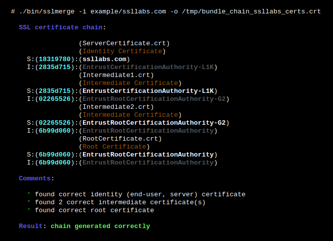

# sslmerge

## Releases

|            **STABLE RELEASE**            |           **TESTING RELEASE**            |
| :--------------------------------------: | :--------------------------------------: |
| []() | []() |
| []() | []() |
| [](https://travis-ci.org/profile/git-template-full) | [](https://travis-ci.org/profile/git-template-full) |

## Description

Is an open source tool to help you build a valid SSL certificate chain.

## Parameters

Provides the following options:

```
  Usage:
    sslmerge <option|long-option>

  Examples:
    sslmerge --in Root.crt --in Intermediate1.crt --in Server.crt --out nginx_bundle.crt
    sslmerge --in /tmp/certs/ --out /tmp/nginx_bundle.crt

  Options:
        --help        show this message
        --debug       displays information on the screen (debug mode)
    -i, --in          add certificates to merge (multiple files or directory)
    -o, --out         saves the result (chain) to file
```

## Requirements

**<u>Sslmerge</u>** uses external utilities to be installed before running:

- [openssl](https://www.openssl.org/)

## Use example

Then an example of starting the tool:

``````
ls
00.crt	01.crt	03.crt
sslmerge -i /tmp/google_cert -o /tmp/bundle_chain_google_certs.crt

  	       (03.crt)
  	       (Identity Certificate)
  S:(a18bd28a):(*.google.com)
  I:(c4c7a654):(GoogleInternetAuthorityG2)
  	       (00.crt)
  	       (Intermediate Certificate)
  S:(c4c7a654):(GoogleInternetAuthorityG2)
  I:(2c543cd1):(GeoTrustGlobalCA)
  	       (01.crt)
  	       (Root Certificate)
  S:(2c543cd1):(GeoTrustGlobalCA)
  I:(2c543cd1):(GeoTrustGlobalCA)

  Result: chain generated correctly
``````

Screen from terminal:



## Logging

After running the script, the `log/` directory is created and in it the following files with logs:

- `<script_name>.<date>.log` - all `_logger()` function calls are saved in it
- `stdout.log` - a standard output and errors from the `_init_cmd()` function are written in it. If you want to redirect the output from command, use the following structure: `your_command >>"$_log_stdout" 2>&1 &`

## Contributing

See [CONTRIBUTING.md](CONTRIBUTING.md).

## Project architecture

    |-- LICENSE.md                 # GNU GENERAL PUBLIC LICENSE, Version 3, 29 June 2007
    |-- README.md                  # this simple documentation
    |-- CONTRIBUTING.md            # principles of project support
    |-- .gitignore                 # ignore untracked files
    |-- .travis.yml                # continuous integration with Travis CI
    |-- setup.sh                   # install git-template-full on the system
    |-- bin
        |-- sslmerge               # main script (init)
    |-- doc                        # includes documentation, images and manuals
        |-- man8
            |-- sslmerge.8         # man page for git-template-full
    |-- lib                        # libraries, external functions
    |-- log                        # contains logs, created after init
    |-- src                        # includes external project files
        |-- helpers                # contains core functions
        |-- import                 # appends the contents of the lib directory
        |-- __init__               # contains the __main__ function
        |-- settings               # contains git-template-full settings

## License

GPLv3 : <http://www.gnu.org/licenses/>

**Free software, Yeah!**